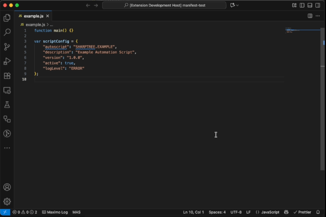
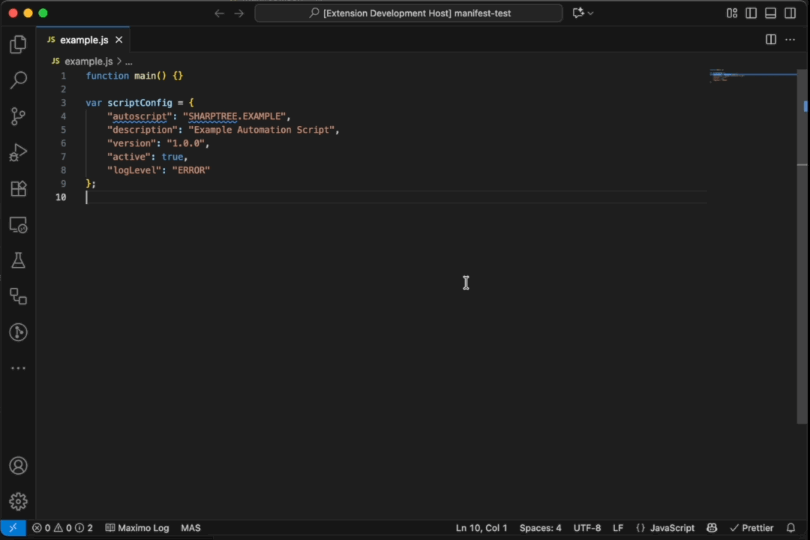
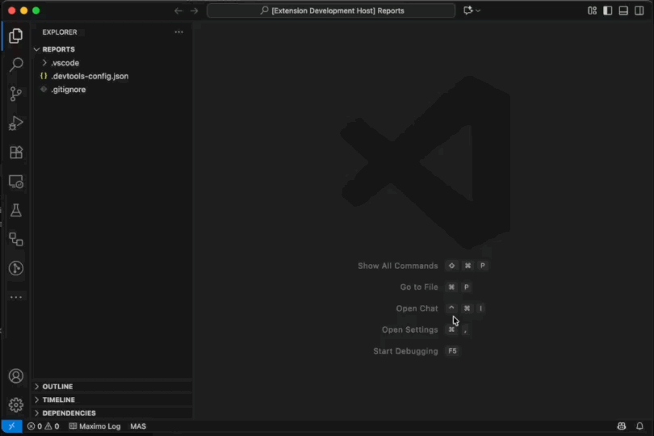
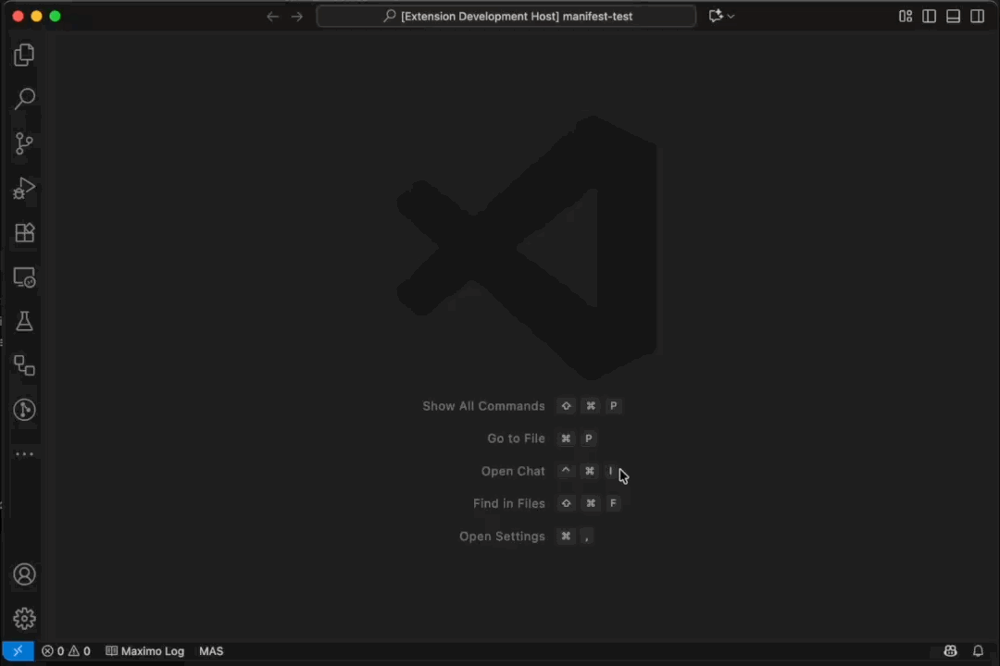
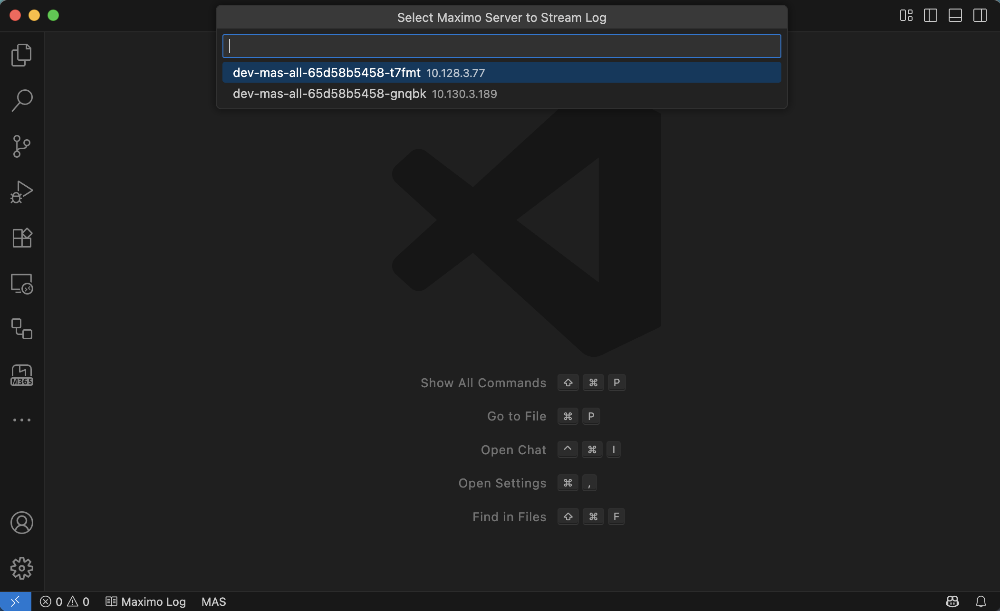
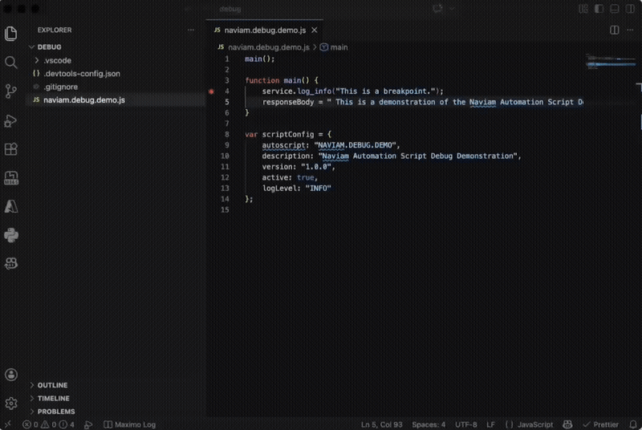

# VS Code Maximo Development Tools

Deploy [Maximo Automation Scripts](https://www.ibm.com/docs/en/mam-saas?topic=SS8CCV/com.ibm.mbs.doc/autoscript/c_automation_scripts.htm), inspection forms, reports and screen definitions directly from Visual Studio Code.

The extension allows developers to describe the automation script through the use of a `scriptConfig` variable and then deploy the script directly to Maximo from Visual Studio Code. The provided `NAVIAM.AUTOSCRIPT.DEPLOY` automation script provides support for build pipelines and automated deployment of automation scripts from a Git repository.

# Configuration

## Visual Studio Code Settings

After installation you must provide connection details for your target instance of Maximo. The connection settings are found in the VS Code Settings (`⌘ + ,` or `ctrl + ,`) under the `Maximo` heading. The table below provides a list of the available settings.

### Maximo Settings

The following are settings available under the `Naviam > Maximo` group.

| Setting                           | Default             | Description                                                                                                                                                                 |
| :-------------------------------- | :------------------ | :-------------------------------------------------------------------------------------------------------------------------------------------------------------------------- |
| Allow Untrusted Certs             | false               | When checked, ignores SSL validation rules.                                                                                                                                 |
| API Key                           |                     | The Maximo API key that will be used to access Maximo. If provided, the user name and password are ignored if configured.                                                   |
| Configuration Timeout             | 5                   | The number of minutes to wait for the configuration to complete.                                                                                                            |
| Context                           | maximo              | The part of the URL that follows the hostname, by default it is `maximo`.                                                                                                   |
| Custom CA                         |                     | The full chain for the server CA in PEM format.                                                                                                                             |
| Extract Inspection Forms Location | Current open folder | Directory where extracted inspection files will be stored.                                                                                                                  |
| Extract Location                  | Current open folder | Directory where extracted script files will be stored.                                                                                                                      |
| Extract Screen Location           | Current open folder | Directory where extracted screen XML files will be stored.                                                                                                                  |
| Extract DBC Location              | Current open folder | Directory where extracted screen DBC files will be stored.                                                                                                                  |
| Host                              |                     | The Maximo host name _without_ the http/s protocol prefix.                                                                                                                  |
| Maxauth Only                      | false               | Both Maxauth and Basic headers are usually sent for login, however on WebLogic if Basic fails the Maxauth header is ignored. When checked, only the Maxauth header is sent. |
| Port                              | 443                 | The Maximo port number, 80 for http, 443 for https or your custom port such as 9080.                                                                                        |
| Proxy Host                        |                     | The proxy host name.                                                                                                                                                        |
| Proxy Port                        | 3128                | The proxy port number.                                                                                                                                                      |
| Proxy User                        |                     | The proxy username for proxy authentication.                                                                                                                                |
| Proxy Password                    |                     | The proxy password for proxy authentication.                                                                                                                                |
| Timeout                           | 30                  | The time in seconds to wait for Maximo to respond.                                                                                                                          |
| User                              |                     | The user that will be used to connect to Maximo.                                                                                                                            |
| Use SSL                           | true                | When checked, SSL will be used, the provided port must be configured for SSL.                                                                                               |
| Debug Port                        | 4711                | The debug port for connecting a remote debugger for automation scripts.                                                                                                     |

> The Authentication Type setting has been removed and replaced with automatic detection of authentication type.

### .devtools-config.json

A file named `.devtools-config.json` can be created in the root directory of the project folder to override the VS Code settings. This file is a JSON formatted file and contains the setting attributes to override, any settings not included in the file will be taken from the VS Code settings.

The `password` and `apiKey` attributes will be automatically encrypted on save. If the `password` or `apiKey` needs to be updated, the encrypted value can be replaced with the new plain text value, which will again be automatically encrypted on save.

#### Sample

```json
{
    "name": "Short name to identify the environment",
    "description": "Longer description of the configured environment",
    "selected":"Optional attribute that indicates that the environment is currently selected when multiple configurations are available",
    "host":"The Maximo host name",
    "port":80|443,
    "context":"maximo",
    "useSSL":true|false,
    "username":"The Maximo username",
    "password":"The Maximo user's password",
    "apiKey":"A Maximo API key",
    "allowUntrustedCerts":true|false,
    "configurationTimeout": 5,
    "timeout":30,
    "ca":"A PEM formatted CA",
    "maxauthOnly":true|false,
    "extractLocation":"Path to the script extract directory",
    "extractLocationScreens":"Path to the screens extract directory",
    "extractLocationForms":"Path to the forms extract directory",
    "extractLocationReports":"Path to the reports extract directory",
    "extractLocationDBC":"Path to the DBC extract directory",****
    "proxyHost":"The proxy host",
    "proxyPort": "The proxy port number",
    "proxyUsername": "The proxy authentication user name",
    "proxyPassword": "The proxy authentication password",
    "debugPort": " The debug port for connecting a remote debugger for automation scripts"
}
```

> Since `.devtools-config.json` may contain sensitive connection information it should _never_ be checked into Git. A `.gitignore` entry for `.devtools-config.json` is automatically created the first time the `.devtools-config.json` is used by the extension to ensure that it is not accidentally included in a commit.

### Multiple Configurations

The `.devtools-config.json` may contain a single configuration or a JSON array of configurations. If an array of environment configurations is provided then the selected environment is displayed in the status bar. Clicking the status bar environment name opens a quick pick list to select the active environment. In the image below the `Test` environment has been selected as can be seen in the status bar and the leading checkbox for the `Test` entry in the quick pick.


> Note that the `name` attribute is required when defining multiple environments. Configurations without the `name` attribute will be excluded from the selection.

### Logging Settings

The following are settings available under the `Naviam > Maximo > Logging` group.

| Setting              | Default | Description                                                                                                              |
| :------------------- | :------ | :----------------------------------------------------------------------------------------------------------------------- |
| Append               | true    | When checked, appends to the current log file.                                                                           |
| Follow               | true    | When checked, if the current log is displayed in the editor the cursor will remain at the end of the file.               |
| Open Editor On Start | true    | When checked, opens the log file editor when logging is started.                                                         |
| Output File          |         | The absolute or relative path to the log file. If using a relative path, it will be relative to the current open folder. |
| Timeout              | 30      | The number of seconds between requests for the log file, this should be less than the connection timeout.                |

## Maximo Configuration

The very first time you connect to Maximo, this extension will add several required automation scripts to Maximo. To deploy these scripts, the extension requires that you be in the Maximo Administrators group and have access to the `MXSCRIPT` and `MXAPIDOMAIN` object structures. To perform the configuration, bring up the Visual Studio Code Command Palette (`View > Command Palette...` or `⌘ + shift + p` or `ctrl + shift + p`) and select `Deploy Automation Script`. You will be prompted for a password and then a dialog will be displayed prompting you to configure Maximo.


Click the `Yes` button to proceed. The configuration should take less than a minute and a progress indicator will be displayed in the bottom right of the screen.


Upon completion a dialog will be displayed confirming the configuration was successful.


The extension is now ready to deploy automation scripts. After the initial configuration, any user that is in the Maximo Administrators group or has been granted the `Deploy Automation Script` permission under the `NAVIAM_UTILS` object structure as shown below can deploy scripts from Visual Studio Code.


For log streaming, any user that is in the Maximo Administrators group or has been granted the `Stream Log` permission under the `LOGGING` application as shown below, has access to stream the Maximo log to Visual Studio Code.


### Maximo Configuration Details

As part of the configuration, an integration object named `NAVIAM_UTILS` is created and the automation scripts listed below are also created.

| Script                           | Description                                                                                         |
| :------------------------------- | :-------------------------------------------------------------------------------------------------- |
| NAVIAM.AUTOSCRIPT.ADMIN          | Script for managing Maximo administrative actions.                                                  |
| NAVIAM.AUTOSCRIPT.DBC            | Script to extract object configurations as DBC.                                                     |
| NAVIAM.AUTOSCRIPT.DEPLOY         | The primary script used for deploying and managing automation scripts.                              |
| NAVIAM.AUTOSCRIPT.DEPLOY.HISTORY | Created after the first script is deployed. Contains a JSON with a history of all scripts deployed. |
| NAVIAM.AUTOSCRIPT.EXTRACT        | Script for extracting scripts from Maximo.                                                          |
| NAVIAM.AUTOSCRIPT.FORM           | Script for managing inspection forms.                                                               |
| NAVIAM.AUTOSCRIPT.LIBRARY        | Script library for applying deployment object defined in JSON deploy files.                         |
| NAVIAM.AUTOSCRIPT.LOGGING        | Script for streaming the Maximo log.                                                                |
| NAVIAM.AUTOSCRIPT.OBJECTS        | Script to extract JSON object configurations.                                                       |
| NAVIAM.AUTOSCRIPT.REPORT         | Script for managing BIRT reports.                                                                   |
| NAVIAM.AUTOSCRIPT.SCREENS        | Script for managing Maximo screen definitions.                                                      |
| NAVIAM.AUTOSCRIPT.STORE          | Script for managing the storage of the deploy history.                                              |

## scriptConfig Variable

Each script must define a variable named `scriptConfig` that is a JSON object describing how to deploy the script. The extension uses these values to populate the corresponding values of the `AUTOSCRIPT` and `SCRIPTLAUNCHPOINT` Maximo Business Objects. At a minimum the `autoscript` attribute is required, all other attributes are optional. All configuration attributes are available and are defined by their label name without spaces, in camel case. The example below provides the basic structure.

A `properties`, `maxvars`, or `messages` property may be included within the `scriptConfig`. Each of these is a JavaScript array (enclosed in brackets `[]`), of objects with each property corresponding to the Maximo attribute name for the value. Each value in the array will create or update a Maximo `property`, `maxvars`, or `message`. A special property of `"delete":"true"` can be specified to delete a `property`, `maxvar`, or `message` in the target system. For a `property` entry a property of `initialPropValue` can be provided to set the initial value of the property if it does not already exist in the system.

All value names within the `scriptConfig` map to the application label, without spaces and in camel case. For example if the label in the application is `Before Save` the corresponding value name is `beforeSave`.

### On Deploy Properties

There are three options for triggering script actions when a script is deployed. The `onDeploy` property can be defined with a value specifying the name of a function within in the deployed script that will be called when the script is deployed, the `onDeployScript` property can be defined with the name of another script that will be invoked when the the current script is deployed or if a script with the same name as the current script with `.DEPLOY` appended to the name exists, it will be automatically invoked. The deploy script will automatically be delete after execution unless the `deleteDeployScript` property is set to `false`.

The following four global variables are provided to the deployment scripts.

| Variable       | Type                                            | Description                                                                                  |
| :------------- | :---------------------------------------------- | :------------------------------------------------------------------------------------------- |
| onDeploy       | boolean                                         | Variable that can be checked within a script to determine if it is being run at deploy time. |
| request        | com.ibm.tivoli.maximo.oslc.provider.OslcRequest | The OslcRequest object for the process deploying the script.                                 |
| service        | com.ibm.tivoli.maximo.script.ScriptService      | The standard service class provided to all automation scripts.                               |
| userInfo       | psdi.security.UserInfo                          | The UserInfo object for the current user.                                                    |
| updateProgress | function                                        | Function that takes a string parameter and updates the deployment progress message.          |

When using a script for deploy actions, that script file may be named the same as the primary script with `-deploy` or `.deploy` appended to the file name and with the same extension to have it automatically deployed with the primary script. For example if a script is contained in a file named `example.js` the deployment script can be saved in a file named `example-deploy.js` or `example.deploy.js` and the deployment script will be deployed to Maximo first so it is available to be called by the primary script at deploy time.

### JSON Deploy File

As of version `1.13.0` a JSON document can be used to define select objects to deploy along with the script. Providing a JSON file with the same name as the primary script, with a `.json` file extension will cause the tooling to deploy the objects defined in the JSON document along with the script.

Currently Cron Tasks, Domains, Loggers, Maximo Objects, Messages and Properties are available. Additional Maximo data types will be added in future releases based on feedback and demand. The JSON schemas for these objects are provided in the project under the `.vscode` directory and your `.vscode/settings.json` will be updated to provide intellisense support in configuration json files.

#### JSON Pre-deploy File

As of version `1.14.0` there is support for a JSON deploy file that is applied prior to deploying the automation script. To have the JSON deploy file applied prior to deploying the automation script, name the file the same as the primary script with `.predeploy.json` as the suffix. The extension will automatically find the file and apply it before deploying the automation script.

As of version `1.23.0` support was added for deploy and predeploy file validation.

For example if a script is contained in a file named `example.js` the pre-deploy JSON file will be named `example.predeploy.json`.

#### Example Deploy JSON

Below is an example deploy JSON that will create or update two messages and a property and then delete the third message `example.exampleMessage3`.

```json
{
    "messages": [
        {
            "msgGroup": "example",
            "msgKey": "exampleMessage",
            "value": "An example message"
        },
        {
            "msgGroup": "example",
            "msgKey": "exampleMessage2",
            "value": "An example message 2"
        },
        {
            "delete": true,
            "msgGroup": "example",
            "msgKey": "exampleMessage3"
        }
    ],
    "properties": [
        {
            "propName": "example.property",
            "description": "Example property",
            "propValue": "Example value"
        }
    ]
}
```

#### Deploying Maximo Objects

When deploying a Maximo Object, by default Maximo will be placed in Admin Mode if required and a database configuration performed. The top level boolean properties `noAdminMode` and `noDBConfig` can be set to not perform a configuration if it requires Admin Mode or skip the database configuration completely.

> Note: When deploying a Maximo Object with Admin Mode and Database Configuration, the user must have Maximo permissions to place Maximo in Admin Mode and run Database Configuration.

If a configuration requires Maximo to be in Admin Mode a confirmation dialog will be displayed, requiring confirmation before the configurations are applied. If the configurations are not applied, the script will also not be deployed, however the configurations will be staged and can be manually applied at a later time.


### Prettier Compatibility

> Maximo requires that JavaScript objects have quoted properties, as shown below. If you are using Prettier as your code formatter it may automatically remove these quotes, which will result in errors when deploying. To retain the quotes go to the Visual Studio Code Settings (`⌘ + ,` or `ctrl + ,`), select `Prettier`, then find the `Quote Props` setting and select the `preserve` option.
>
> 

### JavaScript / Nashorn Example

```javascript
main();

function main() {
    // entry point for the script.
}

var scriptConfig = {
    autoscript: 'EXAMPLE_SCRIPT',
    description: 'An example script for deployment',
    version: '1.0.4',
    active: true,
    allowInvokingScriptFunctions: true,
    logLevel: 'INFO',
    autoScriptVars: [
        {
            varname: 'examplevar',
            description: 'An example variable'
        }
    ],
    scriptLaunchPoints: [
        {
            launchPointName: 'EXAMPLELP',
            launchPointType: 'OBJECT',
            description: 'An example launch point for Labor',
            objectName: 'LABOR',
            save: true,
            add: true,
            update: true,
            beforeSave: true,
            launchPointVars: [
                {
                    varName: 'examplevar',
                    varBindingValue: 'Example binding'
                }
            ]
        }
    ]
};
```

### Python / Jython

For Python / Jython scripts the same JSON script configuration is used, just triple quote it as a `string` value.

```python

def main():
    # entry point for the script.

main()

scriptConfig = """{
    "autoscript":"EXAMPLE_SCRIPT",
    "description":"An example script for deployment",
    "version":"1.0.4",
    "active":true,
    "allowInvokingScriptFunctions":true,
    "logLevel":"INFO",
    "autoScriptVars":[
        {
            "varname":"examplevar",
            "description":"An example variable"
        }
    ],
    "scriptLaunchPoints":[
        {
            "launchPointName":"EXAMPLELP",
            "launchPointType":"OBJECT",
            "description":"An example launch point for Labor",
            "objectName":"LABOR",
            "save":true,
            "add":true,
            "update":true,
            "beforeSave":true,
            "launchPointVars":[
                {
                "varName":"examplevar",
                "varBindingValue":"Example binding"
                }
            ]
        }
    ],
}"""

```

# Features

## Deploy to Maximo

To deploy a script, screen definition or inspection form, open script, screen definition or inspection form extract in Visual Studio Code, then bring up the Visual Studio Code Command Palette (`View > Command Palette...` or `⌘ + shift + p` or `ctrl + shift + p`) and select `Deploy to Maximo`. If this is the first time deploying a script or screen definition after starting Visual Studio Code you will be prompted for your Maximo password as this extension does not store passwords. The script or screen definition is then deployed as seen below.

### Deploy Script


When deploying an automation script, after the script has been deployed you can view the script in Maximo. Each deployment replaces the script launch point configuration with the configuration defined in the `scriptConfig` JSON.


### Deploy Screen


### Deploy Inspection Form


When deploying an inspection form the form is matched based on the inspection form name, not the inspection number since it may differ between the source and target systems. If the form already exists the current form is revised and the form definition completely replaces the previous configuration. The option attribute `activateOnDeploy` can be specified in the inspection form JSON to indicate that the new revision should be marked as active when the form is deployed.

> The `sourceVersion` attribute indicates the version of the source system. Inspection forms are portable between versions as long as the target system is the same or a later version than the source.

### Deploy Report


When deploying a report, the report must be registered in the `reports.xml` file found the in the same folder with the report design file. The `reports.xml` follows the same syntax as the Maximo reporting tools.

> When a report is deployed its request page is automatically generated.

### Deployment Manifest

As of version `1.20.0` a JSON document may be used to define multiple files to deploy in order. The file must have a `.json` file extension and contain a JSON object with a property named `manifest` that is an array of `string` type file paths or a JSON object with a `path` property. The file paths may be relative or fully qualified. Using the `Deploy to Maximo` command will deploy each file in the manifest in order. You can mix `string` and `object` path elements in the array.

#### Example Manifest

```json
{
    "manifest": [
        "file_1.js",
        { "path": "subfolder/file_1.js" },
        "subfolder/file_2.js",
        "c:/fully/qualified/path/file_1.js",
        { "path": "inspection_form.json" },
        "REPORT_FOLDER/birt_report_name.rptdesign"
    ]
}
```

## Extract Automation Scripts

To extract the scripts currently deployed to Maximo, bring up the Visual Studio Code Command Palette (`View > Command Palette...` or `⌘ + shift + p` or `ctrl + shift + p`) and select `Extract Automation Scripts`. The extension will query Maximo for the available scripts and display a list of scripts to select from. Once the desired scripts have been selected, click the `OK` button to extract the scripts. Scripts are saved to the directory specified in the `Extract Location` setting. If the setting has not been configured, the scripts are extracted to the current workspace folder.



## Extract Screen Definitions

To extract the screens from Maximo, bring up the Visual Studio Code Command Palette (`View > Command Palette...` or `⌘ + shift + p` or `ctrl + shift + p`) and select `Extract Screen Definitions`. The extension will query Maximo for the available screens and display a list of screens to select from. Once the desired screens have been selected, click the `OK` button to extract the screens. Screens are saved to the directory specified in the `Extract Screen Location` setting. If the setting has not been configured, the screen definitions are extracted to the current workspace folder.


> The screen definition XML is consistently formatted when extracted to assist with comparison. To ensure the formatting remains consisted, when using the standard XML formatter ensure that the `Space Before Empty Close Tag` is unchecked.
> 

### Extracted Metadata

As of version `1.6.0` extracted screens will include a `metadata` tag that contains the conditional properties configuration. It also includes the security group and condition definitions that support creating the security group if it doesn't exist and creating _or_ updating the conditional expressions. The `metadata` tag is removed as part of the import process and will error if you attempt to import the exported presentation XML through the front end user interface.

## Extract Inspection Forms

To extract inspection forms from Maximo, bring up the Visual Studio Code Command Palette (`View > Command Palette...` or `⌘ + shift + p` or `ctrl + shift + p`) and select `Extract Inspection Forms`. The extension will query Maximo for the latest inspection forms and display a list of available forms to select from. Once the desired inspection forms have been selected, click the `OK` button to extract the inspection forms. Inspection forms are saved to the directory specified in the `Extract Inspection Forms Location` setting. If the setting has not been configured, the inspection forms are extracted to the current workspace folder. The extracted files are named with the inspection form name, with dashes `-` replacing spaces and with a `.json` file extension.

> The extract includes the source inspection form and revision number. Note that these values are for reference purposes only and a new inspection form and revision number will be generated in the target system.



## Extract Reports

To extract reports from Maximo, bring up the Visual Studio Code Command Palette (`View > Command Palette...` or `⌘ + shift + p` or `ctrl + shift + p`) and select `Extract BIRT Reports`. The extension will query Maximo for the registered reports and display a list of available reports to select from. Once the desired reports have been selected, click the `OK` button to extract the reports.
Reports are saved to the directory specified in the `Extract Reports Location` setting. If the setting has not been configured, the reports are extracted to the current workspace folder. The extracted reports are saved to a sub folder named with the `REPORTFOLDER` value from Maximo. Additionally, the report attributes, parameters and resource references are written to a `reports.xml` file in the `REPORTFOLDER` folder. The `reports.xml` has the same syntax as the standard Maximo tools `report.xml` files. If the report has resources, those are extracted to a sub folder with the same name as the report, without the `.rptdesign` extension.\*\*\*\*



## Extract JSON Deploy Files

To extract JSON deploy files from Maximo, bring up the Visual Studio Code Command Palette (`View > Command Palette...` or `⌘ + shift + p` or `ctrl + shift + p`) and select `Extract Maximo JSON`. A list of available object types to extract will be displayed. The list includes object types found in the table below.

| Type                | Description                                          |
| :------------------ | :--------------------------------------------------- |
| Cron Tasks          | Maximo cron tasks, including instances and parameter |
| Domains             | Domains and the domain values                        |
| Integration Objects | Integration end points                               |
| Loggers             | Maximo logger definitions                            |
| Messages            | Maximo messages                                      |
| Properties          | Maximo system properties                             |

Once the type has been selected a list of available objects will be displayed and the list desired objects can be selected. Once the list of objects is selected click the `OK` button to extract the configurations. If a script file is currently selected the corresponding `.json` file will appended to if it exists or a new deploy file will be created. If the deploy `.json` file is selected the results will be appended to the existing file. If neither the script or deploy file are selected the results will be copied to the local clipboard and can be pasted to a deployment json file later.

## Extract DBC Files

To extract DBC scripts from Maximo, bring up the Visual Studio Code Command Palette (`View > Command Palette...` or `⌘ + shift + p` or `ctrl + shift + p`) and select `Extract Maximo DBC`. A list of available object types to extract will be displayed. The list includes object types found in the table below.

| Type                        | Description                                                                          |
| :-------------------------- | :----------------------------------------------------------------------------------- |
| Attribute                   | Maximo attributes from the selected Maximo object.                                   |
| Automation Script           | Automation scripts                                                                   |
| End Point                   | Integration end points                                                               |
| Enterprise Service          | Integration enterprise services                                                      |
| External System             | Integration external systems                                                         |
| Interaction                 | Integration interactions                                                             |
| Invocation Channel          | Integration invocation channels                                                      |
| Message                     | Maximo system messages                                                               |
| Object                      | Maximo Object / Table definition, including indexes and relationships                |
| Object Structure            | Data from a selected integration object structure, filter by a provided where clause |
| Property                    | Maximo system properties                                                             |
| Publish Channel             | Integration publish channels                                                         |
| Records by Object Structure | Data from a selected Maximo object structure, filter by a provided where clause.     |
| Table Data                  | Data from a selected Maximo object, filter by a provided where clause.               |
| Web Service                 | Integration web service                                                              |

Once the type has been selected a list of available objects will be displayed and the list desired objects can be selected. Once the list of objects is selected a prompt to input a file will be displayed. Enter a file name, with files ending in `.dbc` creating DBC formatted file, while `.db2`, `.ora` and `.sqs` create SQL scripts.



For `Records by Object Structure` and `Table Data` there is an additional step, where you must provide a SQL where clause to filter the records extracted from the system.

> Note: When extracting configurations, if the destination file exists, the contents will be overwritten with the value extracted from Maximo.

## Compare with Maximo

To compare the current script or screen definition with the script or screen on the server, bring up the Visual Studio Code Command Palette (`View > Command Palette...` or `⌘ + shift + p` or `ctrl + shift + p`) and select `Compare with Maximo`. The extension will query Maximo for the current script or screen that is in the editor based on the `scriptConfig` variable or `<presentation id=""` attribute and open a new window, providing the Visual Studio Code diff editor.

### Compare Script


### Compare Screen


## Log Streaming

To stream the Maximo log to a local file click the `Maximo Log` status bar item to toggle streaming. The rotating status icon indicates that the log is currently streaming.


If you are streaming logs from a Maximo Application Suite environment with multiple pods, a list of pod names and IP addresses will be displayed so you can select the pod to stream the log from. The name of the pod will be displayed while the log is streaming.



> This feature uses API keys to communicate with other pods in the cluster and will create a temporary API key for the user streaming the log if one does not exist. This temporary key is good for 24 hours and is removed when the user stops streaming.

## Insert Unique Id

When editing a screen definition XML, ensuring that the `id` attribute is unique can be annoying, especially when copying and pasting sections of the screen. Maximo generates unique `id` attribute values based on the current time since epoch in milliseconds and now you can too.

To insert or update the `id` attribute of a tag to the unique value of the current time in milliseconds since epoch, bring up the Visual Studio Code Command Palette (`View > Command Palette...` or `⌘ + shift + p` or `ctrl + shift + p`) and select `Insert Unique Id for Maximo Presentation Tag` or press `ctrl + ⌘ + i` or `ctrl + alt + i`).


## Snippets

The Maximo Development Tools extension provides snippets for all the built in classes including the majority of methods on the `mbo`, `service` and `userInfo` built in objects. While not providing a full language server it should provide a majority of common methods on the implicit variables.

There are also snippets for common functions such as a `close` function or the `scriptConfig` variable. If there are any additional snippets you would like added please contact us at [support@naviam.io](mailto:support@naviam.io).


Pressing `ctrl+space` will bring up help information for each snippet, describing what the snippet does with information about the parameters.


# Remote Debugging

Remote debugging is available for Manage 9.x where Java 17 is used. The extension lets VS Code attach to automation scripts running inside the Maximo JVM so you can debug Jython and JavaScript/Nashorn script execution from your local workspace.

The Maximo debugger runs as an in-process Debug Adapter Protocol (DAP) server inside the JVM. To connect successfully, the debug port, by default `4711`, must be reachable from your machine either through local container port exposure or through OpenShift port-forwarding.

When VS Code attaches, the extension checks whether the matching debugger Jar is already available in the target Maximo environment. If it is missing or out of date, the extension uploads the current version and the `NAVIAM.AUTOSCRIPT.DEBUG` automation script starts the debug server.

> [!WARNING]
> Remote Debugging is experimental.
> Do not use it on a production system.



## Before You Start

Before starting a debug session, make sure the following are true:

- The target system is Maximo Manage 9.x running on Java 17.
- The VS Code settings `naviam.maximo.host` and `naviam.maximo.debugPort` point to the target Maximo system and debug port.
- The Maximo debug adapter is enabled and reachable on the configured port.
- Your local script file name matches the Maximo automation script name.
- Your local workspace includes the script directories you want VS Code to map back to Maximo.
- You can reach the debug port directly or by using port-forwarding.

The attach debugger configuration does not define the remote host or port. The extension always uses `naviam.maximo.host` and `naviam.maximo.debugPort` from your Maximo settings when it opens the debug connection.

Because source mapping is filename-based, the local file name must match the Maximo script name. Local `.py` and `.js` files are indexed by upper-cased file base name when breakpoints are mapped back to deployed scripts.

## Attach Configuration Example

Add an attach configuration to `.vscode/launch.json` similar to the following:

```json
{
    "version": "0.2.0",
    "configurations": [
        {
            "type": "autoscript",
            "request": "attach",
            "name": "Attach to Maximo Automation Script",
            "scriptRoots": ["${workspaceFolder}"]
        }
    ]
}
```

Configuration fields:

- `scriptRoots`: Local folders scanned recursively for `.py` and `.js` files used for source mapping.

Connection settings:

- `naviam.maximo.host`: The Maximo host name used for the debug connection.
- `naviam.maximo.debugPort`: The remote debug port used for the debug connection. This must match the Maximo-side debug adapter port.

> The Maximo property `naviam.autoscript.debug.host` controls the bind address on the Maximo side. The VS Code extension connects using `naviam.maximo.host` and `naviam.maximo.debugPort`.

## Typical Workflow

1. Confirm `naviam.maximo.host` and `naviam.maximo.debugPort` are configured in the Maximo VS Code settings.
2. Confirm the Maximo-side debug properties are configured and the debug port is reachable.
3. Open the local workspace that contains the automation scripts you want to debug.
4. Add or select the `Attach to Maximo Automation Script` launch configuration.
5. Set breakpoints in the local `.py` or `.js` script files.
6. Start the attach configuration from VS Code.
7. Trigger the automation script in Maximo.
8. Inspect variables, evaluate expressions, review console output, and step through execution.

## Debugging Features

- Attach from VS Code to Maximo over TCP
- Line breakpoints
- Conditional breakpoints
- Manual breakpoints from script code
- Step in
- Step over
- Step out
- Paused stack frame inspection
- Expression evaluation
- Console stdout/stderr forwarding

## Variable inspection

The debugger exposes locals and other visible bindings and supports:

- Simple scalar rendering
- Lazy variable expansion
- Collection, map, and array expansion
- Cycle protection
- Expansion depth limits
- Reflective Java object inspection
- Custom higher-signal views for selected Maximo runtime types

For many Java-backed objects you will see:

- Bean properties
- Instance fields
- `__meta__`
- `__methods__`

For Maximo types the debugger adds custom summaries and children for objects such as:

- `ScriptService`
- `MboRemote`
- `MboSetRemote`
- `UserInfo`

## Manual and Conditional Breakpoints

Standard VS Code line breakpoints work without modifying the script source, but you can also add manual breakpoints in script code when needed.

For Jython:

```python
if debugger.isEnabled():
    debugger.breakpoint("before save")
```

For JavaScript/Nashorn:

```javascript
if (__autoscript_debugger.isEnabled()) {
    __autoscript_debugger.breakpoint('before save', 42);
}
```

Conditional breakpoints are evaluated in the script language, not in Java. For example:

- Jython: `mbo.getString("ASSETNUM") == "13170"`
- JavaScript/Nashorn: `mbo.getString("ASSETNUM") === "13170"`

Do not rely on Java-style `.equals(...)` in conditional breakpoint expressions.

## Maximo Properties

| Property                           | Description                                                                                                                                                 |
| :--------------------------------- | :---------------------------------------------------------------------------------------------------------------------------------------------------------- |
| naviam.autoscript.debug.enabled    | Enables the in-process debug adapter. Typical value: `true`                                                                                                 |
| naviam.autoscript.debug.port       | TCP port exposed by the debug adapter. Default: `4711`                                                                                                      |
| naviam.autoscript.debug.host       | Bind host for the adapter listener. Default: `0.0.0.0`                                                                                                      |
| naviam.autoscript.debug.js.exclude | Exact script names to exclude from JavaScript/Nashorn debugger integration, matching is case-insensitive and separators can be commas, whitespace, or both. |

Caught and uncaught exception stopping is controlled by VS Code exception breakpoints (`All Exceptions` and `Uncaught Exceptions`) for the active debug session.

## JavaScript / Nashorn Notes

- JavaScript instrumentation is only applied while a debug client is attached.
- Scripts listed in `naviam.autoscript.debug.js.exclude` do not receive injected debugger bindings or standard line stepping.
- Excluded JavaScript scripts continue through Maximo's native JavaScript execution path.
- The runtime debugger alias for JavaScript is `__autoscript_debugger`.
- JavaScript expression evaluation and conditional breakpoints run against a captured visible-bindings snapshot for the paused frame.

## Limitations

- Source mapping is filename-based rather than driven by authoritative Maximo metadata, so the file name _must_ match the script name.
  The VS Code extension indexes local `.py` and `.js` files by upper-cased file base name, and if multiple files collapse to the same key, the last indexed file wins.
- The debugger is built around a single in-process adapter and a single active paused script.
  One VS Code client attaches to one Maximo-hosted TCP listener, and only one script execution can remain suspended at a time. If another script hits a breakpoint while one is already paused, that second pause is skipped.
- Jython tracing is intentionally limited to the top-level automation script body.
  Stepping and line events do not try to expose arbitrary non-script Python frames, imported library internals, or Java call stacks as normal debugger frames.
- JavaScript/Nashorn frames are reconstructed from instrumentation snapshots rather than from a live lexical debugger API.
  Parent lexical scopes are not fully exposed as live frames, and evaluate/watch expressions run against the captured visible-bindings snapshot for the paused location.
- Step out from the top-level script body usually runs to completion because there is no outer script frame to stop on.
- JavaScript instrumentation only applies while a debug client is attached.
  Excluded scripts from `naviam.autoscript.debug.js.exclude` continue down Maximo's native JavaScript path and do not expose debugger bindings or standard VS Code line stepping.
- Variable inspection is intentionally conservative for Java and Maximo objects.
  The debugger prefers read-safe summaries, fields, and selected bean properties over invoking getters that may mutate state, trigger persistence work, or perform expensive remote access.
- The transport model assumes direct TCP reachability from VS Code to the Maximo JVM host and port.
  There is no built-in authentication, proxying, or remote session brokering in the debugger itself.

## Troubleshooting

- If breakpoints are not hit, confirm that the local file name matches the deployed Maximo script name.
- If VS Code cannot attach, verify that the debug port is exposed or port-forwarded and that `naviam.maximo.host` and `naviam.maximo.debugPort` point to the reachable target.
- If a second script does not pause while another script is already stopped, this is expected because only one paused execution is supported at a time.
- If JavaScript breakpoints are skipped, check whether the script is listed in `naviam.autoscript.debug.js.exclude`.

# Requirements

- Maximo 7.6.0.8 or higher, Maximo Application Suite 8 is supported.
- Files must have a `.js`, `.py`, or `.jy` extension for scripts, `.xml` for screens, `.rptdesign` for BIRT reports and `.json` for inspection forms.
- This extension requires Maximo to support Nashorn scripts, which requires Java 8.
- Initial configuration must be done by a user in the administrative group defined by `ADMINGROUP` `MAXVARS` entry. Typically this is `MAXADMIN`.
